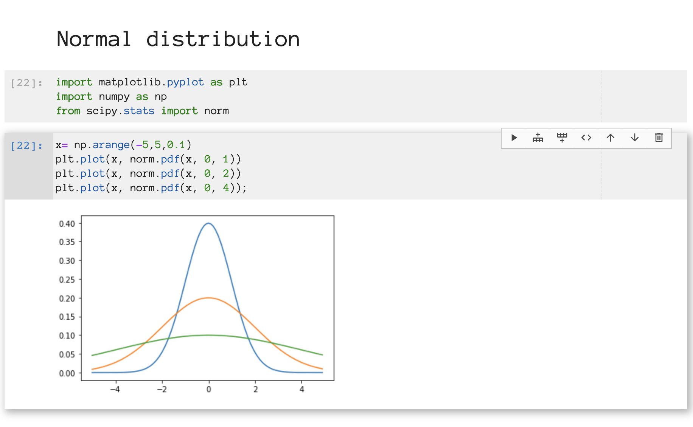

# @eddienko/jupyterlab-colabinspired-codecellbtn

A JupyterLab extension for notebook cells that adds a set of buttons to each cell.

Most of the code of this extension has been borrowed from `@ibqn/jupyterlab-codecellbtn`.



## Prerequisites

* JupyterLab
* @eddienko/jupyterlab-colabinspired-theme-light

## Installation

jupyter labextension install eddienko/jupyterlab-colabinspired-codecellbtn @eddienko/jupyterlab-colabinspired-theme-light

## Development

For a development install (requires npm version 4 or later), do the following in the repository directory:

```bash
npm install
jupyter labextension link .
```

To rebuild the package and the JupyterLab app:

```bash
npm run build
jupyter lab build
```

